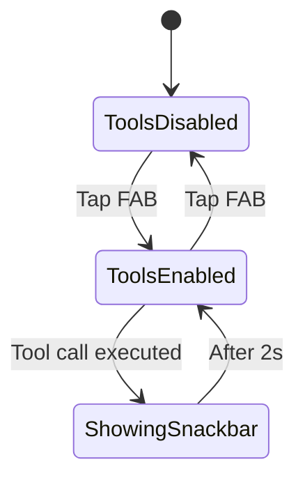

# UX Design: Tool Calling Toggle & Model Capability Display

**Author:** UX Designer Agent  
**Date:** 2026-01-05  
**Status:** Ready for Implementation  
**Target:** Chat View (chat_screen.dart, message_input.dart)

---

## Executive Summary

This design improves the user experience for tool calling toggles and model capability visibility in the chat view. Users need clear, accessible controls to enable/disable tool calling and understand their current model's capabilities at a glance.

### Key Improvements

1. **Quick Tool Toggle** - Add floating action button for instant tool calling on/off
2. **Capability Badges** - Show model capabilities prominently in app bar
3. **Enhanced Capability Info** - Expandable capability panel with details
4. **Dark Mode Optimization** - Ensure all UI elements work beautifully in dark mode
5. **Accessibility** - Proper touch targets, contrast ratios, and semantic labels

---

## Current State Analysis

### What Works Well ✅

- **Capability Detection**: ModelCapabilitiesRegistry accurately identifies model features
- **Settings Integration**: ToolSettingsWidget provides comprehensive tool configuration
- **Visual Indicators**: Message input shows "Tools enabled" and "Vision enabled" badges
- **Loading States**: Shows "AI is thinking with tools..." during tool calls

### Pain Points 🔴

1. **Hidden Toggle**: Tool calling can only be toggled in Settings (buried 3+ taps away)
2. **Static Indicators**: Capability badges in message input are informational only - not interactive
3. **Limited Visibility**: Model capabilities only shown in subtitle text (easy to miss)
4. **No Quick Context**: Users don't know what "tools enabled" means without reading docs
5. **Dark Mode Issues**: Blue badges (`Colors.blue[50]`) may have poor contrast in dark mode
6. **No Quick Comparison**: Can't quickly see if current model supports needed features

---

## Design Solution

### 1. Floating Action Button - Quick Tool Toggle

**Location:** Bottom-right of chat screen, above message input  
**Behavior:** Toggle tool calling on/off with single tap  
**Visual:** Animated icon that changes state

#### States

| State | Icon | Color | Tooltip |
|-------|------|-------|---------|
| Tools Enabled | `Icons.build_circle` | Primary (green accent) | "Tools ON (tap to disable)" |
| Tools Disabled | `Icons.build_circle_outlined` | Surface variant (grey) | "Tools OFF (tap to enable)" |
| Model Doesn't Support | `Icons.build_circle_outlined` + slash | Disabled grey | "Model doesn't support tools" |

#### Positioning

```
┌─────────────────────────────┐
│         App Bar             │
├─────────────────────────────┤
│                             │
│    Message Bubbles          │
│                             │
│                             │
│                        ┌──┐ │ ← Floating Action Button
│                        │🛠│ │   (70dp from bottom)
│                        └──┘ │
├─────────────────────────────┤
│  Message Input              │
└─────────────────────────────┘
```

#### Interaction Flow



#### Dark Mode Considerations

- **Enabled State**: Use `colorScheme.primary` (adapts to theme)
- **Disabled State**: Use `colorScheme.surfaceVariant` with 60% opacity
- **Shadow**: Elevation 4 with `colorScheme.shadow`

---

### 2. Model Capability Badges in App Bar

**Location:** Below model name in app bar  
**Layout:** Horizontal chip row with icons

#### Design Specs

```
┌─────────────────────────────────────────┐
│  ← [🤖] Qwen 2.5 7B                     │
│         [🛠 Tools] [👁 Vision] [💻 Code] │ ← Capability chips
└─────────────────────────────────────────┘
```

#### Badge Specifications

| Capability | Icon | Color (Light) | Color (Dark) | Label |
|------------|------|---------------|--------------|-------|
| Tools | `Icons.build_circle` | Blue 700 | Blue 200 | "Tools" |
| Vision | `Icons.visibility` | Purple 700 | Purple 200 | "Vision" |
| Code | `Icons.code` | Green 700 | Green 200 | "Code" |
| Long Context | `Icons.data_object` | Orange 700 | Orange 200 | "128K+" |

#### Implementation

```dart
// In app bar title widget
Row(
  children: [
    CircleAvatar(...),
    Expanded(
      child: Column(
        crossAxisAlignment: CrossAxisAlignment.start,
        children: [
          Text(_conversation?.title ?? 'Chat'),
          Row(
            children: [
              Text(_conversation?.modelName ?? 'Demo Mode'),
              SizedBox(width: 4),
              _buildCapabilityBadges(), // New widget
            ],
          ),
        ],
      ),
    ),
  ],
)
```

#### Dark Mode Color Mapping

```dart
Color _getCapabilityColor(String capability, ColorScheme colorScheme) {
  final isDark = colorScheme.brightness == Brightness.dark;
  switch (capability) {
    case 'tools':
      return isDark ? Colors.blue.shade200 : Colors.blue.shade700;
    case 'vision':
      return isDark ? Colors.purple.shade200 : Colors.purple.shade700;
    case 'code':
      return isDark ? Colors.green.shade200 : Colors.green.shade700;
    default:
      return colorScheme.outline;
  }
}
```

---

### 3. Expandable Capability Info Panel

**Trigger:** Tap on capability badge or info icon  
**Type:** Bottom sheet modal  
**Purpose:** Explain what each capability means and show current tool config

#### Content Structure

```
┌─────────────────────────────────────────┐
│ Model Capabilities                   [X]│
├─────────────────────────────────────────┤
│                                         │
│ Qwen 2.5 7B Instruct                    │
│ Context: 128K tokens                    │
│                                         │
│ ┌──────────────────────────────────┐   │
│ │ [🛠] Tool Calling                │   │
│ │     Can use external tools like  │   │
│ │     web search to find info      │   │
│ │                                  │   │
│ │     Status: ✅ Enabled           │   │
│ │     [Disable] [Configure]        │   │
│ └──────────────────────────────────┘   │
│                                         │
│ ┌──────────────────────────────────┐   │
│ │ [👁] Vision Support              │   │
│ │     Can analyze images and       │   │
│ │     understand visual content    │   │
│ │                                  │   │
│ │     Status: ⚠️ Not supported     │   │
│ └──────────────────────────────────┘   │
│                                         │
│ ┌──────────────────────────────────┐   │
│ │ [💻] Code Optimized              │   │
│ │     Specialized for programming  │   │
│ │     and technical tasks          │   │
│ │                                  │   │
│ │     Status: ✅ Supported         │   │
│ └──────────────────────────────────┘   │
│                                         │
└─────────────────────────────────────────┘
```

#### Interaction

- **Tap capability card** → Quick toggle (for tools/vision)
- **Tap "Configure"** → Opens detailed settings
- **Tap outside** → Dismisses sheet

#### Dark Mode

- Background: `colorScheme.surfaceContainerHigh`
- Card background: `colorScheme.surfaceContainerHighest`
- Text: `colorScheme.onSurface`
- Dividers: `colorScheme.outlineVariant`

---

### 4. Enhanced Message Input Badges

**Current Issue:** Static badges that only show info  
**New Design:** Interactive badges with visual hierarchy

#### Redesign Specs

**Before:**
```
┌──────────────────────────────────────┐
│ 🛠 Tools enabled • 👁 Vision enabled │ ← Static, passive
└──────────────────────────────────────┘
```

**After:**
```
┌──────────────────────────────────────┐
│ ┌──────────┐  ┌──────────┐          │
│ │🛠 Tools  │  │👁 Vision │  [ℹ]     │ ← Interactive chips
│ └──────────┘  └──────────┘          │
└──────────────────────────────────────┘
```

#### Behavior

- **Chip appearance**: Material Design 3 FilterChip
- **Selected state**: Tools/Vision enabled (filled background)
- **Unselected state**: Tools/Vision disabled (outline only)
- **Info button**: Opens capability panel
- **Tap chip**: Toggle capability (if model supports it)

#### Color Scheme

```dart
// Light mode
selected: colorScheme.primaryContainer
selectedLabel: colorScheme.onPrimaryContainer
unselected: colorScheme.surface
unselectedLabel: colorScheme.onSurfaceVariant

// Dark mode  
selected: colorScheme.primaryContainer (darker shade)
selectedLabel: colorScheme.onPrimaryContainer (lighter)
unselected: colorScheme.surfaceContainerHighest
unselectedLabel: colorScheme.onSurface
```

#### Implementation Notes

```dart
FilterChip(
  label: Row(
    mainAxisSize: MainAxisSize.min,
    children: [
      Icon(Icons.build_circle, size: 16),
      SizedBox(width: 4),
      Text('Tools'),
    ],
  ),
  selected: widget.supportsTools && toolsEnabled,
  onSelected: modelSupportsTools 
    ? (selected) => _toggleTools(selected)
    : null, // Disabled if model doesn't support
  backgroundColor: colorScheme.surfaceContainerHighest,
  selectedColor: colorScheme.primaryContainer,
  checkmarkColor: colorScheme.onPrimaryContainer,
)
```

---

### 5. Visual State Indicators

#### Loading State with Tool Activity

**Current:** "AI is thinking with tools..."  
**Enhanced:** Show which tool is being called

```
┌──────────────────────────────────────┐
│  ⏳ Searching the web...             │
│  [━━━━━━━━━━━━━━━░░░░] 70%          │
└──────────────────────────────────────┘
```

#### Tool Call Results

Show inline tool execution results in message:

```
┌──────────────────────────────────────┐
│ 🛠 Tool: Web Search                   │
│ Query: "Latest Flutter version"      │
│ Results: 5 sources found             │
│ ────────────────────────────────────  │
│ [Based on search results...]         │
└──────────────────────────────────────┘
```

---

## Accessibility Guidelines

### Touch Targets

- **FAB**: 56×56dp minimum (Material Design standard)
- **Capability chips**: 48dp height minimum
- **Info buttons**: 44×44dp minimum (WCAG AAA)

### Color Contrast

All text and icons must meet WCAG AA standards:
- **Normal text**: 4.5:1 contrast ratio
- **Large text (18pt+)**: 3:1 contrast ratio
- **Interactive elements**: 3:1 contrast ratio

### Screen Reader Support

```dart
Semantics(
  label: 'Tool calling toggle',
  hint: toolsEnabled 
    ? 'Double tap to disable tool calling'
    : 'Double tap to enable tool calling',
  enabled: modelSupportsTools,
  child: FloatingActionButton(...)
)
```

### Keyboard Navigation

- FAB should be focusable via keyboard
- Capability chips should support keyboard selection
- Info panel should trap focus and have clear dismiss action

---

## Responsive Design

### Phone (< 600dp width)

- FAB: 56×56dp, 16dp margin from edges
- Capability chips: Wrap to multiple lines if needed
- Panel: Full-width bottom sheet

### Tablet (600dp - 840dp)

- FAB: Same as phone
- Capability chips: Single row with horizontal scroll
- Panel: Centered dialog (max 560dp width)

### Desktop (> 840dp)

- FAB: Optional (can use always-visible toggle)
- Capability chips: Always visible, no scroll
- Panel: Popover next to capability badges

---

## Implementation Phases

### Phase 1: Foundation (MVP)
- [ ] Add FAB for tool toggle
- [ ] Add capability badges to app bar
- [ ] Ensure dark mode compatibility
- [ ] Add semantic labels for accessibility

### Phase 2: Enhanced Interaction
- [ ] Convert message input badges to interactive chips
- [ ] Add capability info panel (bottom sheet)
- [ ] Add tool execution status indicators
- [ ] Add animations and transitions

### Phase 3: Polish
- [ ] Add keyboard navigation support
- [ ] Add haptic feedback on toggle
- [ ] Add tool call result previews
- [ ] Optimize for tablets and desktop

---

## Developer Handover

### Files to Modify

1. **lib/screens/chat_screen.dart**
   - Add FloatingActionButton for tool toggle
   - Add capability badges to app bar title
   - Add capability info bottom sheet
   - Update dark mode theme handling

2. **lib/widgets/message_input.dart**
   - Replace static badges with FilterChips
   - Add interaction handlers for chip selection
   - Update color scheme for dark mode
   - Add info button

3. **lib/models/conversation.dart**
   - Add `toolCallingEnabled` boolean field
   - Add `copyWith` method for toggling
   - Persist state in conversation

4. **lib/services/chat_service.dart**
   - Add method to toggle tool calling per conversation
   - Update `sendMessage` to respect toggle state
   - Cache tool calling preference

### New Widget: CapabilityBadges

```dart
class _CapabilityBadges extends StatelessWidget {
  final ModelCapabilities capabilities;
  final VoidCallback? onInfoTap;

  const _CapabilityBadges({
    required this.capabilities,
    this.onInfoTap,
  });

  @override
  Widget build(BuildContext context) {
    final colorScheme = Theme.of(context).colorScheme;
    final isDark = colorScheme.brightness == Brightness.dark;
    
    return Wrap(
      spacing: 4,
      children: [
        if (capabilities.supportsTools)
          _CapabilityChip(
            icon: Icons.build_circle,
            label: 'Tools',
            color: isDark ? Colors.blue.shade200 : Colors.blue.shade700,
          ),
        if (capabilities.supportsVision)
          _CapabilityChip(
            icon: Icons.visibility,
            label: 'Vision',
            color: isDark ? Colors.purple.shade200 : Colors.purple.shade700,
          ),
        if (capabilities.supportsCode)
          _CapabilityChip(
            icon: Icons.code,
            label: 'Code',
            color: isDark ? Colors.green.shade200 : Colors.green.shade700,
          ),
        if (onInfoTap != null)
          InkWell(
            onTap: onInfoTap,
            child: Icon(
              Icons.info_outline,
              size: 14,
              color: colorScheme.outline,
            ),
          ),
      ],
    );
  }
}

class _CapabilityChip extends StatelessWidget {
  final IconData icon;
  final String label;
  final Color color;

  const _CapabilityChip({
    required this.icon,
    required this.label,
    required this.color,
  });

  @override
  Widget build(BuildContext context) {
    return Container(
      padding: EdgeInsets.symmetric(horizontal: 6, vertical: 2),
      decoration: BoxDecoration(
        color: color.withValues(alpha: 0.15),
        borderRadius: BorderRadius.circular(8),
        border: Border.all(color: color.withValues(alpha: 0.3), width: 1),
      ),
      child: Row(
        mainAxisSize: MainAxisSize.min,
        children: [
          Icon(icon, size: 12, color: color),
          SizedBox(width: 3),
          Text(
            label,
            style: TextStyle(
              fontSize: 10,
              fontWeight: FontWeight.w600,
              color: color,
            ),
          ),
        ],
      ),
    );
  }
}
```

### New Widget: ToolToggleFAB

```dart
class _ToolToggleFAB extends StatelessWidget {
  final bool toolsEnabled;
  final bool modelSupportsTools;
  final ValueChanged<bool> onToggle;

  const _ToolToggleFAB({
    required this.toolsEnabled,
    required this.modelSupportsTools,
    required this.onToggle,
  });

  @override
  Widget build(BuildContext context) {
    final colorScheme = Theme.of(context).colorScheme;
    
    return Semantics(
      label: 'Tool calling toggle',
      hint: modelSupportsTools
        ? (toolsEnabled 
            ? 'Double tap to disable tool calling'
            : 'Double tap to enable tool calling')
        : 'Model does not support tool calling',
      enabled: modelSupportsTools,
      child: FloatingActionButton(
        onPressed: modelSupportsTools 
          ? () => onToggle(!toolsEnabled)
          : null,
        backgroundColor: toolsEnabled
          ? colorScheme.primary
          : colorScheme.surfaceVariant,
        disabledElevation: 0,
        elevation: 4,
        child: Icon(
          toolsEnabled 
            ? Icons.build_circle
            : Icons.build_circle_outlined,
          color: toolsEnabled
            ? colorScheme.onPrimary
            : colorScheme.onSurfaceVariant,
        ),
      ),
    );
  }
}
```

### State Management

Add to `_ChatScreenState`:

```dart
bool _toolCallingEnabled = true; // Default to enabled

void _toggleToolCalling(bool enabled) {
  if (widget.chatService == null || _conversation == null) return;
  
  setState(() => _toolCallingEnabled = enabled);
  
  // Update conversation
  final updatedConversation = _conversation!.copyWith(
    toolCallingEnabled: enabled,
    updatedAt: DateTime.now(),
  );
  
  widget.chatService!.updateConversation(updatedConversation);
  
  // Show feedback
  HapticFeedback.lightImpact();
  ScaffoldMessenger.of(context).showSnackBar(
    SnackBar(
      content: Text(enabled 
        ? 'Tool calling enabled'
        : 'Tool calling disabled'),
      duration: Duration(seconds: 1),
    ),
  );
}
```

### Testing Checklist

- [ ] Tool toggle works on models that support tools
- [ ] Tool toggle disabled on models without tool support
- [ ] Capability badges show correct icons and colors
- [ ] Dark mode: All text has sufficient contrast
- [ ] Dark mode: Badges are clearly visible
- [ ] Accessibility: Screen reader announces states correctly
- [ ] Accessibility: All touch targets are 44×44dp minimum
- [ ] Responsive: Works on phone, tablet, and desktop
- [ ] Animation: Smooth transitions when toggling
- [ ] Persistence: Tool preference saved to conversation

---

## Design Rationale

### Why Floating Action Button?

1. **Visibility**: Always accessible, doesn't require navigation
2. **Familiar Pattern**: Users recognize FABs as primary actions
3. **Thumb-Friendly**: Bottom-right placement for right-handed users
4. **Contextual**: Only shown when relevant (chat with tool-capable model)

### Why Capability Badges in App Bar?

1. **Glanceability**: Immediately visible without interaction
2. **Context Awareness**: Users know what features are available
3. **Trust Building**: Transparency about model capabilities
4. **Reduces Errors**: Users won't try to attach images to text-only models

### Why Interactive Chips Instead of Static Badges?

1. **Empowerment**: Users control features without deep menus
2. **Feedback**: Visual state makes enabled/disabled obvious
3. **Discoverability**: Users explore by tapping (progressive disclosure)
4. **Consistency**: Matches Material Design 3 chip patterns

### Why Info Panel?

1. **Education**: Users learn what capabilities mean
2. **Configuration**: Quick access to tool settings
3. **Status**: See current configuration at a glance
4. **Troubleshooting**: Understand why features may not work

---

## Future Enhancements

### Advanced Tool Configuration
- Per-conversation tool allowlist
- Tool execution history
- Tool performance metrics

### Smart Suggestions
- Auto-enable tools based on user query
- Suggest vision models when images are detected
- Recommend code models for programming questions

### Visual Feedback
- Animated tool execution indicators
- Tool result cards with previews
- Token usage visualization

---

## Wireframes

### Light Mode - Chat View with Tool Toggle

```
┌───────────────────────────────────────┐
│ ←  [🤖] Qwen 2.5 7B             ℹ ⋮  │
│         🛠 Tools  👁 Vision  💻 Code  │
├───────────────────────────────────────┤
│                                       │
│  Hello! How can I help you today?    │
│                                       │
│                What's the weather?    │
│                                       │
│  🛠 Searching the web...              │
│  [━━━━━━━━━━━━━━░░░] 80%            │
│                                       │
│                                       │
│                                  ┌──┐ │
│                                  │🛠│ │
│                                  └──┘ │
├───────────────────────────────────────┤
│ ┌───────┐  ┌───────┐  [ℹ]           │
│ │🛠 Tools│  │👁 Vision│               │
│ └───────┘  └───────┘                 │
│ [  Type a message...        ] [↑]    │
└───────────────────────────────────────┘
```

### Dark Mode - Chat View with Tool Toggle

```
┌───────────────────────────────────────┐
│ ←  [🤖] Qwen 2.5 7B             ℹ ⋮  │█
│         🛠 Tools  👁 Vision  💻 Code  │█
├───────────────────────────────────────┤█
│█                                     █│█
│█ Hello! How can I help you today?  █ │█
│█                                     █│█
│█               What's the weather?  █ │█
│█                                     █│█
│█ 🛠 Searching the web...            █ │█
│█ [━━━━━━━━━━━━━━░░░] 80%          █ │█
│█                                     █│█
│█                                     █│█
│█                                 ┌──┐ │█
│█                                 │🛠│█│█
│█                                 └──┘ │█
├───────────────────────────────────────┤█
│█┌───────┐  ┌───────┐  [ℹ]          █│█
│█│🛠 Tools│  │👁 Vision│              █│█
│█└───────┘  └───────┘                █│█
│█[  Type a message...        ] [↑]   █│█
└───────────────────────────────────────┘█
 ████████████████████████████████████████
```

### Capability Info Panel

```
┌───────────────────────────────────────┐
│ Model Capabilities                 [X]│
├───────────────────────────────────────┤
│                                       │
│ Qwen 2.5 7B Instruct                  │
│ Family: Qwen • Context: 128K tokens   │
│                                       │
│ ╔═════════════════════════════════╗   │
│ ║ 🛠 Tool Calling                 ║   │
│ ║                                 ║   │
│ ║ Let the AI use external tools   ║   │
│ ║ like web search to get current  ║   │
│ ║ information and facts.          ║   │
│ ║                                 ║   │
│ ║ Status: ✅ Enabled              ║   │
│ ║ [Disable] [⚙ Configure]         ║   │
│ ╚═════════════════════════════════╝   │
│                                       │
│ ┌─────────────────────────────────┐   │
│ │ 👁 Vision Support               │   │
│ │                                 │   │
│ │ Analyze images and understand   │   │
│ │ visual content.                 │   │
│ │                                 │   │
│ │ Status: ⚠️ Not Supported        │   │
│ │ (Try: llama3.2-vision)          │   │
│ └─────────────────────────────────┘   │
│                                       │
│ ┌─────────────────────────────────┐   │
│ │ 💻 Code Optimization            │   │
│ │                                 │   │
│ │ Specialized for programming     │   │
│ │ and technical tasks.            │   │
│ │                                 │   │
│ │ Status: ✅ Supported            │   │
│ └─────────────────────────────────┘   │
│                                       │
└───────────────────────────────────────┘
```

---

## Conclusion

This design enhances user experience by:

1. **Making tool control accessible** - FAB provides instant toggle
2. **Increasing transparency** - Capability badges show model features
3. **Improving discoverability** - Interactive chips invite exploration
4. **Ensuring dark mode compatibility** - Theme-aware color system
5. **Meeting accessibility standards** - WCAG AA compliance

The implementation is phased to deliver value incrementally while maintaining code quality and test coverage.

